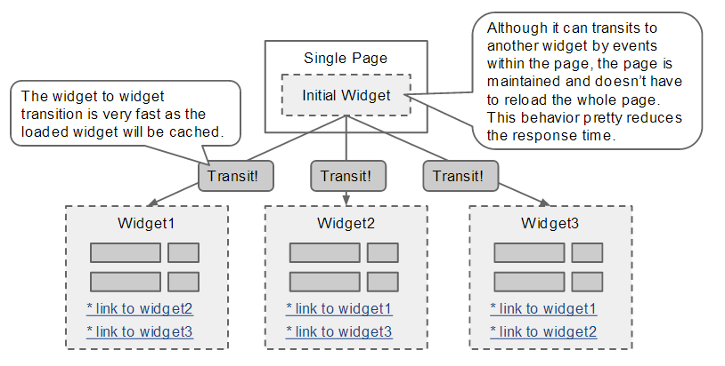
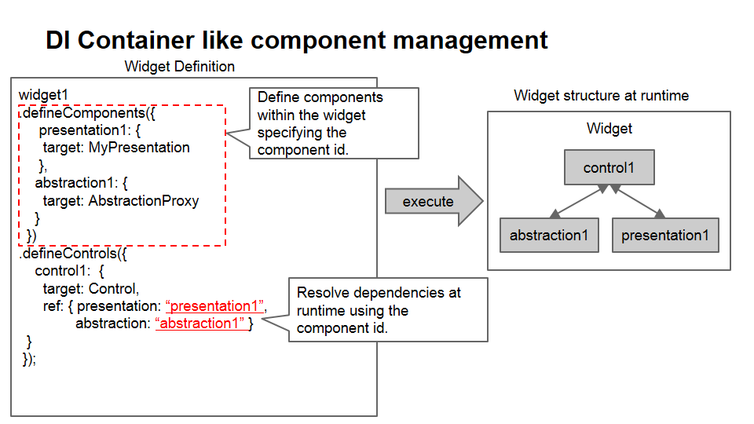
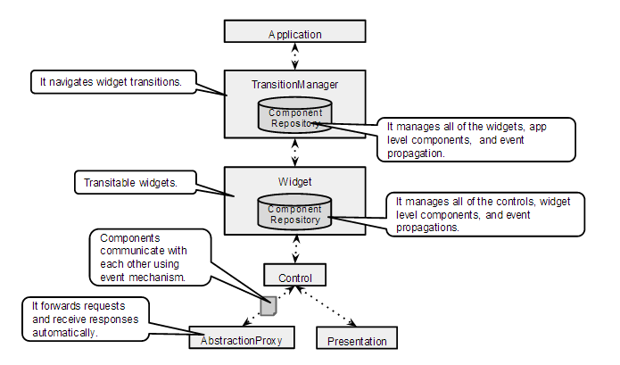
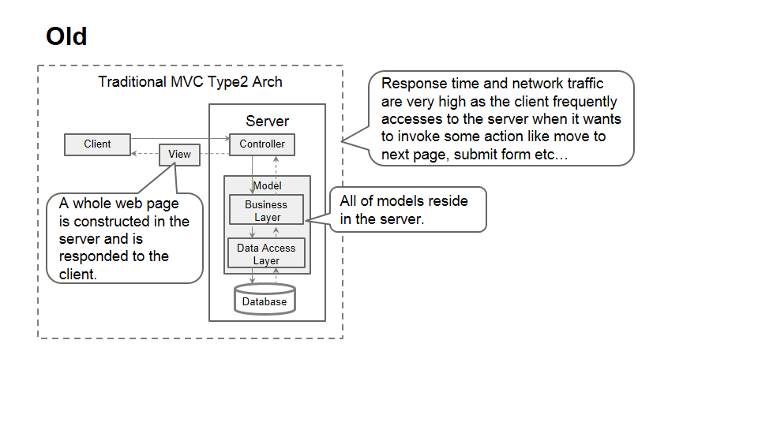
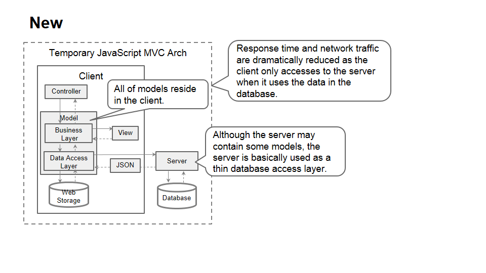
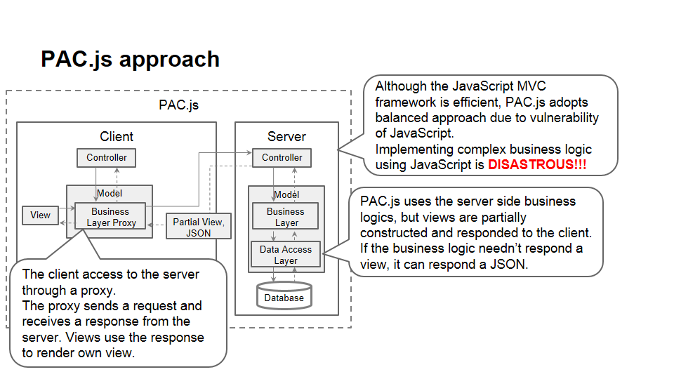

# PAC.js

PAC.js is a javascript framework that is based on the PAC architecture pattern.

## Motivation

In traditional MVC frameworks, there are no abstraction of widgets and hierarchical structures.
MVC applications tend to be complex and be difficult to reuse components.
On the other hand, the PAC pattern resolves these problems more gracefully,
so I decided to develop own PAC based framework.

## What's the "PAC architecture pattern"?

The description of the pattern in Wikipedia is following.
http://en.wikipedia.org/wiki/Presentation%E2%80%93abstraction%E2%80%93control
>Presentation–abstraction–control (PAC) is a software architectural pattern.
>It is an interaction-oriented software architecture, and is somewhat similar to
>model–view–controller (MVC) in that it separates an interactive system into three
>types of components responsible for specific aspects of the application's functionality.
>The abstraction component retrieves and processes the data, the presentation
>component formats the visual and audio presentation of data, and the control
>component handles things such as the flow of control and communication
>between the other two components .[1]

>In contrast to MVC, PAC is used as a hierarchical structure of agents,
>each consisting of a triad of presentation, abstraction and control parts.
>The agents (or triads) communicate with each other only through the control part
>of each triad. It also differs from MVC in that within each triad, it completely
>insulates the presentation (view in MVC) and the abstraction (model in MVC).
>This provides the option to separately multithread the model and view
>which can give the user experience of very short program start times,
>as the user interface (presentation) can be shown before the abstraction has fully initialized.

## The key concepts of "PAC.js"

The key concepts of the PAC.js are following.
* PAC pattern based hierarchical structure
* Very simple, template based transition mechanism
* DI container like component management facility
* Proxying application abstractions that reside on application servers

## Overview

### Basic behavior



### Component definition



### Structure



### Proxying server side models







## Code examples

### Implements own presentations.

```javascript:SearchBox

SearchBox = Object.create(Presentation, {

    fields: { value: {
        searchBoxEl: { value: null, writable: true },
        inputBox: { value: null, writable: true },
        resultSummary: { value: null, writable: true },
        submitButton: { value: null, writable: true },
        loadingImg: { value: null, writable: true }
    }},

    initialize: { value: function(control) {
        Presentation.initialize.call(this, control);
        this.searchBoxEl = this.elem;
        this.doQueries({
            inputBox: ".input",
            resultSummary: ".resultSummary",
            submitButton: ".submit",
            loadingImg: ".loadingImg"});

        this.on(this.submitButton, "click", this.submit);
        this.on(this.inputBox, "keypress", function(event) {
            if ( event.keyIdentifier === "Enter" ) {
                this.submit();
            }
        })
        this.event()
            .ref().onAbstraction().load(this.renderSuccess)
            .ref().onAbstraction().failure(this.renderFailure);
    }},

    submit: { value: function() {
        if ( this.submitting ) {
            return;
        }
        this.disableSubmitting();
        this.event().raise().start({ phrase: this.inputBox.value, initialized: true });
    }},

    renderSuccess: { value: function(result) {
        this.enableSubmitting();
        var contentCount = result.contentCount;
        var contentFound = result.contentFound;
        var searchTime = result.searchTime;
        this.resultSummary.innerHTML = "Your search request has been completed.(matched count=" + contentFound +
        ", retrieved count=" + contentCount + ", search time=" + searchTime + "ms)";
    }},

    renderFailure: { value: function(result) {
        this.enableSubmitting();
        this.resultSummary.innerHTML =
            "Your search request has been failed. A error may be occurred in the server side." +
            "(" + result.message + ")";
    }},

    enableSubmitting: { value: function() {
        this.submitting = false;
        this.submitButton.style.disable = false;
        this.inputBox.style.disable= false;
        this.loadingImg.style.display = "none";
    }},

    disableSubmitting: { value: function() {
        this.submitting = true;
        this.submitButton.style.disable = true;
        this.inputBox.style.disable= true;
        this.loadingImg.style.display = "inline";
        this.resultSummary.innerHTML= "now searching...";
    }}
 });
```

### Implements own abstractions(optional)

### Defines widgets
```javascript:SearchBoxWidgetFactory.js

SearchWidgetFactory = function (arg) {

    var SEARCH_URL = "/solr_ui/apps/search";
    var FACET_URL = "/solr_ui/apps/facets";
    var widget = Widget.create(arg);
    return widget
        .defineComponents({
            searchBox : {
                target : SearchBox,
                arg : { rootQuery : ".searchBox" }
            },
            streamContentView : {
                target : StreamContentView,
                arg : { rootQuery : ".right" }
            },
            compositeView : {
                target : CompositePresentation,
                ref : { views : [ "searchBox", "streamContentView" ] }
            },
            searchBoxModel : {
                target : StreamContentModel,
                arg : {
                    reqResMap : Maps.putAll(Id.START, Id.LOAD),
                    resHandler : function (xhr) {
                        return {
                            searchPhrase : xhr.getResponseHeader("Search-Phrase"),
                            searchInitialized : xhr.getResponseHeader("Search-Initialized") === "false" ? false : true,
                            contentCount : xhr.getResponseHeader("Content-Count"),
                            contentFound : xhr.getResponseHeader("Content-Found"),
                            searchTime : xhr.getResponseHeader("Search-Time"),
                            responseBody : xhr.responseText
                        }
                    },
                    url : SEARCH_URL
                },
                ref : { facetManager : "facetManager" }
            },
            facetView : {
                target : FacetView,
                arg : { rootQuery : ".facetView" }
            },
            facetModel : {
                target : FacetManager,
                arg : {
                    reqResMap : Maps.putAll(Id.START, Id.LOAD, Id.CHANGE, Id.OTHER),
                    resHandler : AbstractionProxy.AS_TEXT,
                    url : FACET_URL
                }
            }
        })
        .defineControls({
            searchControl : {
                target : Control,
                ref : { presentation : "compositeView", abstraction : "searchBoxModel" }
            },
            facetControl : {
                target : Control,
                ref : { presentation : "facetView", abstraction : "facetModel" }
            }
        });
}
```

### Defines an application.
```javascript:index.js

      /**
       * Construct and start your application!
       */
      $(function() {
        var application = Application.create("application",
            document.querySelector("#appContainer"), {
            search: SearchWidgetFactory
        });

        application.start("search");
      });
```


