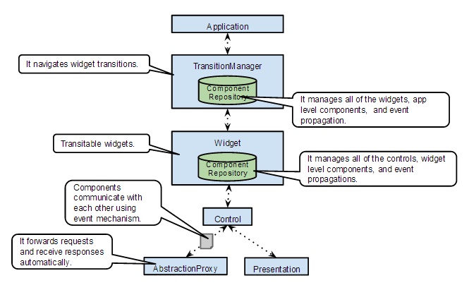

# simple-pac

simple-pac is a javascript framework that is based on the PAC architecture pattern.

## Motivation

In traditional MVC frameworks, there are no abstraction of widgets and hierarchical structures.
MVC applications tend to be complex and be difficult to reuse components.
On the other hand, the PAC pattern resolves these problems more gracefully,
so I decided to develop own PAC based framework.

## What's the "PAC architecture pattern"?

The description of the pattern in Wikipedia is following.
http://en.wikipedia.org/wiki/Presentation%E2%80%93abstraction%E2%80%93control
>Presentation–abstraction–control (PAC) is a software architectural pattern.
>It is an interaction-oriented software architecture, and is somewhat similar to
>model–view–controller (MVC) in that it separates an interactive system into three
>types of components responsible for specific aspects of the application's functionality.
>The abstraction component retrieves and processes the data, the presentation
>component formats the visual and audio presentation of data, and the control
>component handles things such as the flow of control and communication
>between the other two components .[1]

>In contrast to MVC, PAC is used as a hierarchical structure of agents,
>each consisting of a triad of presentation, abstraction and control parts.
>The agents (or triads) communicate with each other only through the control part
>of each triad. It also differs from MVC in that within each triad, it completely
>insulates the presentation (view in MVC) and the abstraction (model in MVC).
>This provides the option to separately multithread the model and view
>which can give the user experience of very short program start times,
>as the user interface (presentation) can be shown before the abstraction has fully initialized.

## The key concepts of "simple-pac"

The key concepts of the simple-pac are following.
* PAC pattern based hierarchical structure
* Very simple, template based transition mechanism
* DI container like component management facility
* Proxying application abstractions that reside on application servers

## Overview

### Basic behavior


### Structure



## Code examples

```javascript:SettingsWidgetFactory
/**
 * define a widget factory.
 * It contains some controls.
 */
SettingsWidgetFactory = function(id, elem, repository) {
    var SETTINGS_URL = "/solr_ui/apps/settings";
    var widget = Widget.create(id, elem, repository)
    .defineComponents({
        settingsForm: function(id, elem) { return SettingsForm.create(elem.querySelector(".settingsForm"), id); },
        settingsRetrieveModel: function(id) {
            var reqResMap = {};
            reqResMap[Id.start()] = Id.load();
            var model =  AbstractionProxy.create(id, reqResMap, SETTINGS_URL);
            model.resHandler = AbstractionProxy.AS_TEXT;

            return model;
        },

        settingsUpdateModel: function(id) {
            var reqResMap = {};
            reqResMap[Id.load()] = Id.load();
            var model =  AbstractionProxy.create(id, reqResMap, SETTINGS_URL);
            model.resHandler = AbstractionProxy.AS_TEXT;
            model.method = "POST";

            return model;
        },

        compositeModel: function(id) {
            return CompositeModel.create(id, [this.get("settingsRetrieveModel"), this.get("settingsUpdateModel")]);
        }
    })
    .defineControls({
        settingsControl: function(id, widget) {
            var settingsForm = this.get("settingsForm", widget.elem);
            var model = this.get("compositeModel");

            return Control.create(id, widget, settingsForm, model);
        },
    });

    return widget;
}
```

```javascript:index.js
      /**
       * Construct and start your application!
       */
      $(function() {
        var application = Application.create("application",
            document.querySelector("#appContainer"), {
            search: SearchWidgetFactory,
            settings: SettingsWidgetFactory
        });

        application.start("search");
      });
```


